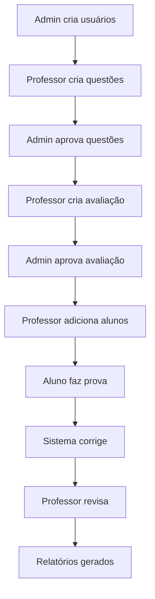

# Sistema de Avaliações

Sistema completo de gestão de avaliações educacionais com arquitetura separada entre frontend e backend.

## 📁 Estrutura do Projeto

```
sistema-avaliacoes/
├── frontend/                   # Aplicação Next.js (React/TypeScript)
│   ├── app/                   # Next.js App Router
│   ├── components/            # Componentes React
│   ├── contexts/              # Context API
│   ├── lib/                   # Utilitários e API client
│   ├── types/                 # Definições TypeScript
│   ├── package.json           # Dependências do frontend
│   └── README.md              # Documentação do frontend
├── backend/                   # Aplicação Spring Boot (Java)
│   ├── src/main/java/         # Código fonte Java
│   ├── src/main/resources/    # Recursos e configurações
│   ├── pom.xml               # Dependências do backend
│   └── README.md             # Documentação do backend
└── README.md                 # Este arquivo (documentação principal)
```

## 🚀 Quick Start

### Pré-requisitos
- **Java 17+** (para o backend)
- **Node.js 18+** (para o frontend)
- **Maven** (incluído no projeto backend)

### 1. Executar Backend

```bash
cd backend
./mvnw spring-boot:run
```
🌐 **Backend API:** http://localhost:8080
📚 **Swagger UI:** http://localhost:8080/swagger-ui.html

### 2. Executar Frontend

```bash
cd frontend
npm install
npm run dev
```
🌐 **Frontend App:** http://localhost:3000

## 🔧 Desenvolvimento

### Backend (Spring Boot)
```bash
cd backend

# Executar aplicação
./mvnw spring-boot:run

# Executar testes
./mvnw test

# Gerar build
./mvnw clean package
```

### Frontend (Next.js)
```bash
cd frontend

# Instalar dependências
npm install

# Executar em desenvolvimento
npm run dev

# Build de produção
npm run build

# Executar produção
npm start
```

## 🧪 Testes e Qualidade

```bash
# Backend - Testes unitários
cd backend && ./mvnw test

# Frontend - Linting
cd frontend && npm run lint

# Frontend - Verificação de tipos
cd frontend && npm run type-check
```

## 📋 Tecnologias

### Backend
- ☕ **Java 17** + **Spring Boot 3.2.1**
- 🔐 **Spring Security** + **JWT**
- 🗄️ **Spring Data JPA** + **H2/MySQL**
- 📝 **OpenAPI/Swagger**

### Frontend  
- ⚛️ **Next.js 14** + **React 18**
- 📘 **TypeScript**
- 🎨 **Tailwind CSS**
- 🔄 **Axios** para API calls

## 🎯 Funcionalidades

### 👨‍💼 Administração
- Gestão de usuários e perfis
- Configuração do sistema
- Aprovação de questões e avaliações
- Relatórios executivos

### 👩‍🏫 Portal do Professor
- Criação de questões
- Montagem de avaliações
- Correção manual/automática
- Acompanhamento de resultados

### 👨‍🎓 Portal do Aluno
- Visualização de provas disponíveis
- Aplicação de avaliações online
- Histórico de notas
- Resultados detalhados

## 🔒 Autenticação

### Usuários Padrão
| Perfil | Email | Senha | Acesso |
|--------|-------|-------|--------|
| Admin | admin@sistema.com | admin123 | Gestão completa |
| Professor | professor@sistema.com | prof123 | Criação e correção |
| Aluno | aluno@sistema.com | aluno123 | Aplicação de provas |

## 🐳 Docker (Opcional)

```bash
# Backend
cd backend
docker build -t sistema-avaliacoes-backend .
docker run -p 8080:8080 sistema-avaliacoes-backend

# Frontend  
cd frontend
docker build -t sistema-avaliacoes-frontend .
docker run -p 3000:3000 sistema-avaliacoes-frontend
```

## 📈 APIs Principais

### Autenticação
- `POST /api/auth/login` - Login
- `GET /api/auth/me` - Perfil atual

### Gestão  
- `GET /api/usuarios` - Usuários
- `GET /api/questoes` - Questões
- `GET /api/avaliacoes` - Avaliações

### Aplicação
- `GET /api/participantes/aluno/disponiveis` - Provas disponíveis
- `POST /api/respostas` - Salvar resposta

📚 **Documentação completa:** http://localhost:8080/swagger-ui.html

## 🔄 Fluxo de Trabalho



## 🤝 Contribuição

1. Fork o projeto
2. Crie sua feature branch (`git checkout -b feature/amazing-feature`)
3. Commit suas mudanças (`git commit -m 'Add amazing feature'`)
4. Push para a branch (`git push origin feature/amazing-feature`)
5. Abra um Pull Request

## 📄 Licença

Este projeto está licenciado sob a Licença MIT - veja o arquivo [LICENSE](LICENSE) para detalhes.

## 🆘 Suporte

- 📧 **Email:** suporte@sistema-avaliacoes.com
- 🐛 **Issues:** [GitHub Issues](../../issues)
- 📖 **Wiki:** [Documentação Técnica](../../wiki)

---

**Desenvolvido com ❤️ usando Spring Boot e Next.js**

*Sistema robusto, escalável e pronto para produção.*
